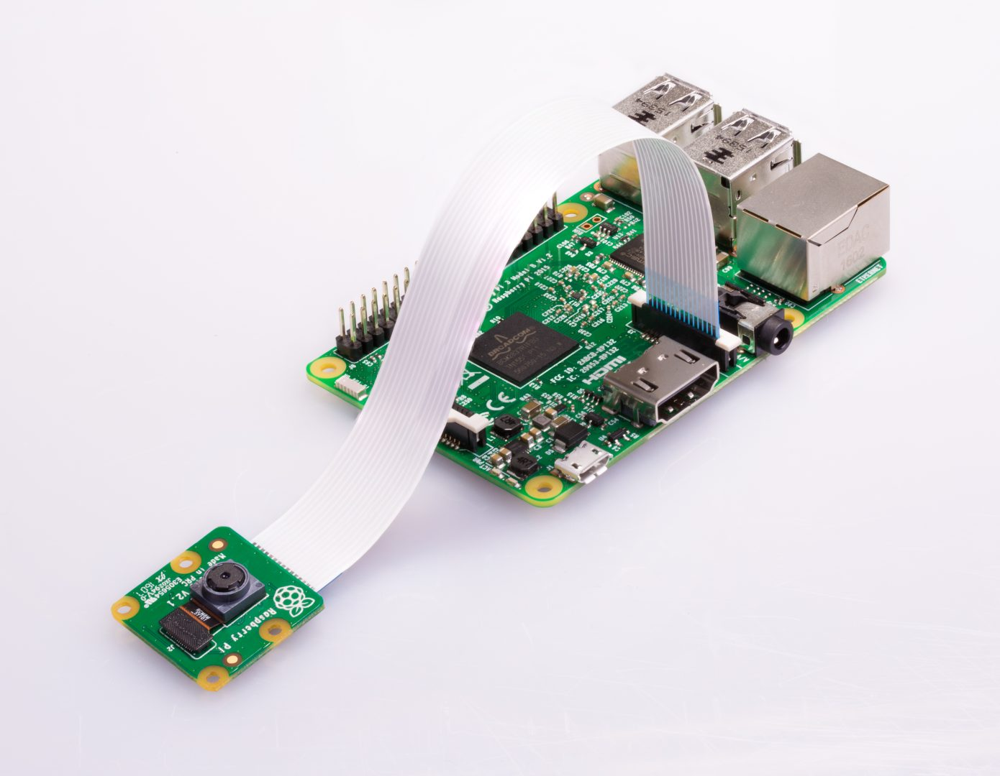

# Rc-PC drive an R/C car with a PC

## Project summary

Combine these elements: 

<table>
  <tr>
    <td>
      
    </td>
    <td>
      
    </td>
    <td>
      
    </td>
    <td>
      
    </td>
  </tr>
</table>

## Software
- Ubuntu Linux - Focal Fossa (20.04)
- ROS 2 Galactic Geochelone

Ros messages graph:

## Hardware
- Old RC car
- ESP32-CAM
  

## Planning

